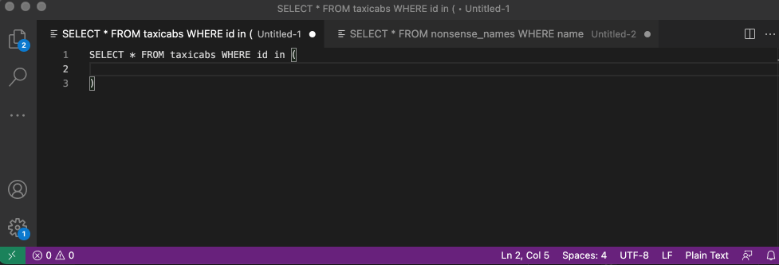

# jims-sql-utils README

This extension adds some simple commands to help when creating sql statements.
It's really just a quick hack for my personal use but happy to consider ideas for how to make it better...

## Features

 * Create csv separated records to put in an 'in' clause
 

## Extension Settings

None as of yet

## Known Issues

None as of yet

## Release Notes
### 0.0.1-2

First ever extension.

-----------------------------------------------------------------------------------------------------------
